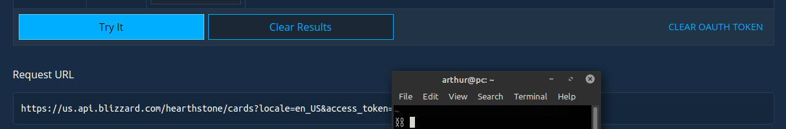

## Relay compatible GraphQL Hearthstone cards API.
And a card scraper utility.

### Packages

This repository contains two packages: 
- The **scraper** which is responsible for retrieving card data from blizzard's api and creating mongo documents from it.
- The **server** which uses the data createad from the scraper to power up a Relay compatible GraphQL server.

### Environment setup

- Head to [blizzard](https://develop.battle.net/documentation/hearthstone/game-data-apis) and generate yourself an access token. Your code will be seen like below after clicking the "Try it" button on the "cards search" section and following it's instructions. .

- Get your mongodb server up and running. This can be done using docker, if you'd like to: `docker run --name hearthstone -p 27017:27017 -d -t mongo`.
- Fill in the necessary information on the .env files. There is one for each package (one for the scraper and one for the server).

### Usage

After doing the setup above all you'll need to do to get your server up and running is run two commands on the root of the repository:
- `yarn scraper:seed` to run the scraper and get the cards to your mongo database.
- `yarn dev:server` to run nodemon on your server and start playing with it.